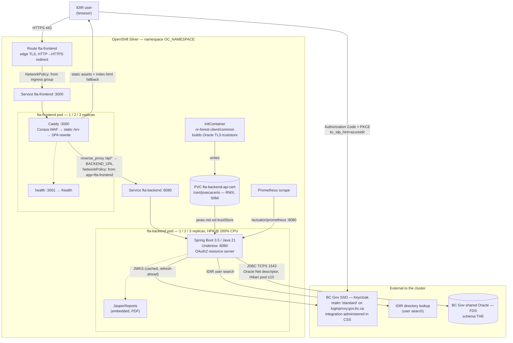
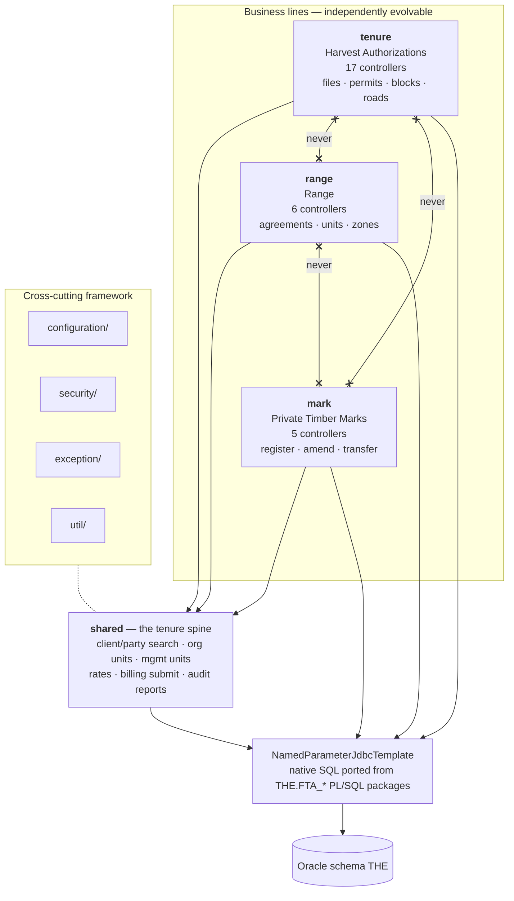
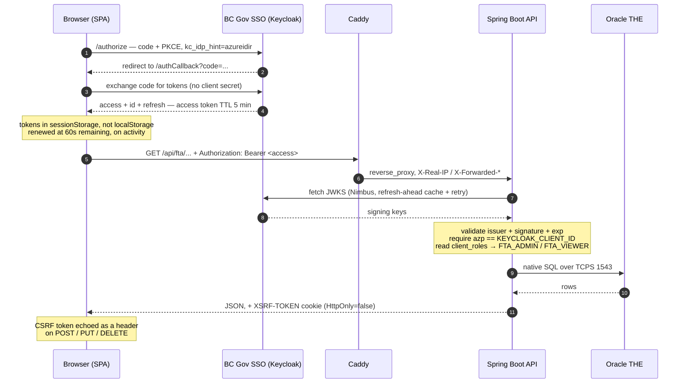
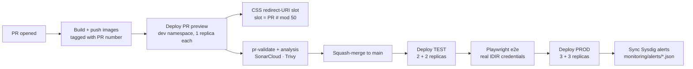

# FTA Architecture

The big picture for the modernized **Forest Tenure Administration** application:
one React SPA and one Spring Boot backend, deployed as two OpenShift services
against the BC Gov shared Oracle (FDS) database, with authentication through
**BC Gov SSO (Keycloak), administered in CSS**.

- Business scope and module rationale: [`adr/0001-modular-monolith.md`](adr/0001-modular-monolith.md)
- Running it locally: [root README](../README.md#local-development)
- Component detail: [`backend/README.md`](../backend/README.md) · [`frontend/README.md`](../frontend/README.md)

> **Auth migration status.** This document describes BC Gov SSO (Keycloak),
> matching [`nr-fam`](https://github.com/bcgov/nr-fam) and the sibling
> [`nr-rept`](https://github.com/bcgov/nr-rept). **The code in this repository
> now matches it** — the Cognito/Amplify surface has been removed.
> [Section 3](#3-authentication-and-authorization) ends with what changed, and
> with the CSS-console work that still has to happen outside the repo.

---

## 1. Runtime topology

Everything the user touches is inside one OpenShift Silver namespace. The
frontend pod is the only thing the router can reach; the backend is reachable
only from the frontend pods and from cluster monitoring. Both NetworkPolicies
are required — Silver namespaces are default-deny on ingress.



**Notes on the edges that matter**

| Edge | Why it looks like that |
|---|---|
| `caddy → /api*` | The SPA never calls the backend cross-origin in a deployed env — Caddy proxies same-origin. `forward-headers-strategy: framework` lets Spring reconstruct the browser-facing URL from `X-Forwarded-*`. |
| `boot → Oracle` | TCPS only. The Silver listener exposes port **1543** and rejects EZConnect, so the URL is a full Oracle Net connect descriptor with a JKS truststore. |
| `boot → Keycloak` | JWKS only. Everything the API needs is on the access token, so there is no `/userinfo` round-trip per request — or per sign-in. |
| PVC, not Secret | The truststore is assembled at pod start by the shared `bcgov/nr-forest-client/common` init container and written to a `ReadWriteMany` PVC, because both containers run with `readOnlyRootFilesystem: true`. |
| Two NetworkPolicies | Without `allow-from-openshift-ingress-to-frontend` the Route is Admitted but returns 503; without `allow-from-frontend-and-monitoring-to-backend` every `/api/*` call is a 502. |

Both pods run `runAsNonRoot`, `readOnlyRootFilesystem: true`,
`allowPrivilegeEscalation: false`, `capabilities: drop [ALL]`, and
`automountServiceAccountToken: false`.

The realm host is per environment:

| Environment | Issuer URI |
|---|---|
| dev / PR previews | `https://dev.loginproxy.gov.bc.ca/auth/realms/standard` |
| test | `https://test.loginproxy.gov.bc.ca/auth/realms/standard` |
| prod | `https://loginproxy.gov.bc.ca/auth/realms/standard` |

---

## 2. Backend module boundaries

The backend is a **modular monolith**: one deployable whose top-level Java
packages are the module boundaries. The three business lines may depend on
`shared`, and never on each other.



The crossed edges are the rule, not a description: an unchecked
`range → tenure` import erodes the whole benefit, and future extraction of a
line becomes a packaging change rather than a rewrite. See ADR 0001 for why
three services up front would have produced a distributed monolith instead.

**Data access is JDBC, not JPA.** 34 services build native SQL against the
`THE` schema through `NamedParameterJdbcTemplate`, each one porting a specific
legacy Oracle package (`THE.FTA_100_TENURE`, `THE.FTA_930_AAC`,
`THE.FTA_940_SALE_INFO`, …). There is exactly one JPA entity
(`UserPreferenceEntity`, backed by an in-memory repository) and no local
database — the query paths are only exercised in a deployed environment.

---

## 3. Authentication and authorization

FTA is a **resource server only**. BC Gov SSO issues the token, the SPA carries
it, and the backend independently enforces what the UI merely hides. FTA never
performs the login redirect server-side and holds no client secret in the
browser — the SPA is a public client using Authorization Code + PKCE.



### What replaced what

| Cognito / FAM (before) | BC Gov SSO / CSS (now) |
|---|---|
| AWS Cognito user pool, `ca-central-1` | Keycloak realm `standard` on `loginproxy.gov.bc.ca` |
| AWS Amplify in the SPA | `oidc-client-ts`, Authorization Code + PKCE |
| `cognito:groups` claim | `client_roles` claim (CSS), or `resource_access.<azp>.roles` (stock Keycloak) |
| `token_use` claim check | `azp` claim check — Keycloak does not emit `token_use` at all |
| `COGNITO_USERINFO_URI` round-trip | nothing — every claim FTA needs is on the access token |
| Pre-token-generation Lambda | nothing; roles are assigned in CSS and mapped into the token |
| Roles registered per Cognito client | Roles on FTA's **CSS integration**, per environment |

Role codes are unchanged: **`FTA_ADMIN`** (full CRUD) and **`FTA_VIEWER`**
(read-only), matched verbatim. Writes are admin-only at the endpoint level, and
sign-in remains IDIR only.

### Three things that are easy to get wrong

**`azp` must be checked.** The standard realm is *shared*. Other applications'
clients issue tokens signed by the same issuer and verifiable against the same
JWKS, so signature and issuer validation alone do not establish that a token was
meant for FTA — only that the realm minted it. Every token must carry
`KEYCLOAK_CLIENT_ID` as its `azp` or be refused. `client_roles` limits the blast
radius in practice, since another client's token carries that client's roles,
but that is a property of how CSS happens to populate the claim rather than a
control FTA enforces — and it stops holding the moment someone adds a role
mapper.

**The IdP hint is `azureidir`, not `idir`.** FTA uses the standard realm's
*IDIR - MFA* integration, which federates IDIR through Azure AD under that
alias. Getting it wrong is not an error — an alias the realm does not recognise
is silently ignored and Keycloak falls through to whatever provider the client
has, so on a single-provider integration the wrong value still reaches the right
place, right up until a second provider is added.

**Read both role claims.** CSS emits `client_roles`; stock Keycloak puts the
same information under `resource_access.<azp>.roles`. Read `client_roles` first
and fall back, because which one appears depends on the realm's mappers. Filter
out FAM's `FAM:`-prefixed sidecar roles (e.g.
`FAM:EXPIRES:2026-09-30:FTA_ADMIN`) — CSS records per-grant expiry as a role
name because a role is a name and nothing else, and they would otherwise show up
as granted authorities.

### Claims read from the access token

| Field | IDIR claim |
|---|---|
| username | `idir_username` |
| user GUID | `idir_user_guid` |
| OIDC subject | `preferred_username` (`<guid>@idir`) |
| calling application | `azp` |
| identity provider | `identity_provider` |
| roles | `client_roles`, falling back to `resource_access.<azp>.roles` |

Also read where present: `given_name`, `family_name`, `email`. GUIDs are
normalised to bare uppercase hex.

### Session handling in the SPA

Tokens live in `sessionStorage` — they survive a page reload but not a closed
tab, where `localStorage` would leave them readable to any script on the origin
for longer than the session needs. The access token lives five minutes and is
renewed once 60 seconds remain, on user activity; there is deliberately no
background poll, so an idle user times out rather than being kept alive by a
timer. Redirect URIs are derived from the runtime origin
(`<origin><base path>/authCallback`, post-logout `<origin><base path>`) so one
built image is promotable across PR previews, TEST and PROD — each of those URIs
has to be registered on the CSS integration.

**Revocation latency.** Roles are read from the token rather than resolved per
request, so pulling someone's access takes effect at their next token refresh —
up to one refresh cycle, not immediately.

### Defence in depth

Caddy sets CSP, HSTS, `X-Frame-Options` and friends on every response, and
Spring Security sets its own header set plus CORS from `ALLOWED_ORIGINS` for the
direct-origin case. The CSP `connect-src` no longer needs to name any AWS host:
`'self' https://*.gov.bc.ca wss://*.gov.bc.ca` covers `loginproxy.gov.bc.ca`.

The frontend mirrors the authorization matrix in `routes/access.ts` (capability
predicates) and `routes/routePaths.ts` (role-gated nav) — mirrors, not enforces.

### Migration status

The move from FAM/Cognito to BC Gov SSO is **implemented in this repository**.
[`nr-rept`](https://github.com/bcgov/nr-rept) was the reference implementation.

What changed, for anyone reading a pre-migration branch:

| Where | Change |
|---|---|
| `backend/.../security/Oauth2SecurityCustomizer.java` | `token_use` validator dropped (Keycloak never emits it, so it would have failed every request); `azp` check added against `KEYCLOAK_CLIENT_ID`; roles read from `client_roles` with a `resource_access.<azp>.roles` fallback, `FAM:` sidecars filtered |
| `backend/.../security/CognitoUserInfoService.java` | Deleted — the profile claims ride the access token, so there is no `/userinfo` round-trip |
| `backend/.../util/JwtPrincipalUtil.java` | Reads `idir_username` / `idir_user_guid` / `identity_provider` / `display_name`; normalises every IDIR alias (`azureidir` included) to `IDIR` and upper-cases the GUID. Pinned by `JwtPrincipalUtilTest` |
| `backend/.../security/HeadersSecurityCustomizer.java` | The two hardcoded AWS hosts are gone from `connect-src` |
| Backend env | `AWS_COGNITO_ISSUER_URI` → `KEYCLOAK_ISSUER_URI`; `COGNITO_USERINFO_URI` and `IDENTITY_LOOKUP_BASE_URL` dropped; `KEYCLOAK_CLIENT_ID` added |
| `frontend/src/services/keycloak.ts` | New — the `UserManager`, `kc_idp_hint=azureidir`, sessionStorage token store, derived redirect URIs |
| `frontend/src/pages/AuthCallback/` | New — the explicit code exchange, guarded against StrictMode double-mount |
| `frontend/src/context/auth/*`, `services/apiFetch.ts` | `aws-amplify` → `oidc-client-ts`; `config/fam/config.ts` deleted |
| Frontend env | `VITE_USER_POOLS_ID`, `VITE_USER_POOLS_WEB_CLIENT_ID`, `VITE_REDIRECT_SIGN_OUT` → `VITE_KEYCLOAK_URL`, `VITE_KEYCLOAK_CLIENT_ID` |
| `frontend/Caddyfile` | The two AWS hosts dropped from `connect-src` |
| `frontend/e2e/` | sessionStorage snapshotted and restored by hand (`fixtures.ts`) — Playwright's `storageState` does not capture it, and that is where the tokens are |

**Resolved: FTA needs no user-lookup service.** `IDENTITY_LOOKUP_BASE_URL` was
configured but never read by any Java code — no controller, service or client
referenced it. It was deleted rather than repointed, so nr-rept's
`nr-user-lookup-api` service-account arrangement does not apply here. If a user
directory is ever needed, that is the thing to adopt.

**Still outside the repository.** Nothing above works until the CSS integration
exists per environment, with the redirect URIs registered and the profile claims
mapped onto the **access** token — see §11 of the migration playbook. Missing
`idir_username` on the access token does not error; it silently routes every user
down the GUID path.

---

## 4. Frontend composition

React 19 + TypeScript on Vite 6, using the BC Gov Carbon theme.

```
src/
├── routes/        routePaths.ts (nav model) + access.ts (role capabilities)
├── pages/         one folder per screen, named after its legacy FTA screen id
│                  (TenureSearch = FTA001, TenureDetail = FTA100, …)
├── services/      one typed module per backend controller
│                  → http.ts → apiFetch.ts (bearer token + ProblemDetail parsing)
├── components/    SearchResultsTable, Tombstone, DefinitionGrid, ScreenPlaceholder
├── context/       auth (OIDC), theme, notifications
└── mocks/         mock records for screens not yet wired to the API
```

Two screen patterns cover most of the app: **search → list** (criteria grid →
Carbon `DataTable` → row links to a detail route) and **tabbed detail**
(tombstone of key facts + one tab per sub-entity). Exhibit-A spatial screens add
Leaflet.

Environment values (`VITE_*`) are inlined into the bundle at build time, so a
`.env` change requires restarting `npm run dev`, and each deployed environment
gets its own image build.

---

## 5. Delivery pipeline



Deploys are `oc process` over the two templates
[`backend/openshift.deploy.yml`](../backend/openshift.deploy.yml) and
[`frontend/openshift.deploy.yml`](../frontend/openshift.deploy.yml), run through
`bcgov/action-deployer-openshift`. (`backend/openshift/deployment.yaml` is an
unused duplicate that no workflow references — don't edit it expecting a
deploy to change.) `merge.yml` re-resolves the PR
number for the merge commit so PROD ships the exact image tag that was tested.

**Redirect-URI slots.** Every redirect URI has to be pre-registered on the CSS
integration, which does not fit ephemeral PR hostnames. The workflow buckets
each PR into one of 50 pre-registered slots (`PR # mod 50`) and uses the slot in
the Route's `spec.host`. Two concurrent PRs 50 apart would collide; with a
typical handful of open PRs that is an accepted trade. The mechanism is
unchanged by the move off Cognito — only the registry it points at changed.

---

## Stack summary

| Layer | Choice | Notable constraint |
|---|---|---|
| Frontend | React 19, TypeScript, Vite 6, Carbon (BCGov theme) | `VITE_*` inlined at build time |
| Frontend runtime | Caddy + Coraza WAF | read-only rootfs; `/srv` seeded into an emptyDir by an init container |
| Backend | Spring Boot 3.5, Java 21, Undertow (Tomcat excluded) | `-Xmx200m`, 800Mi limit |
| Data access | `NamedParameterJdbcTemplate`, native SQL | no JPA entities, no local DB |
| Database | BC Gov shared Oracle (FDS), schema `THE` | TCPS 1543, JKS truststore, connect descriptor |
| Auth | BC Gov SSO (Keycloak), administered through CSS | shared realm — `azp` must be checked; roles on FTA's CSS integration |
| Reports | JasperReports 6.21, embedded | JRXML compiled at runtime into `/tmp` |
| Platform | OpenShift Silver | default-deny ingress; restricted-v2 SCC |
| Observability | Actuator + Prometheus scrape, Sysdig alerts | `/actuator/prometheus` on :8080 |
